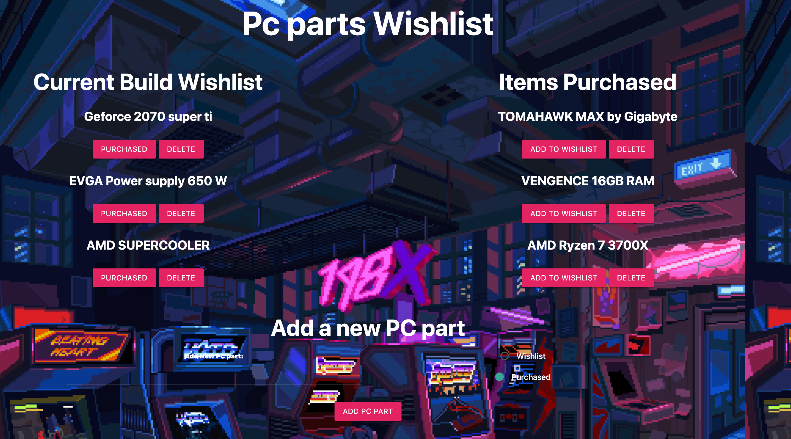
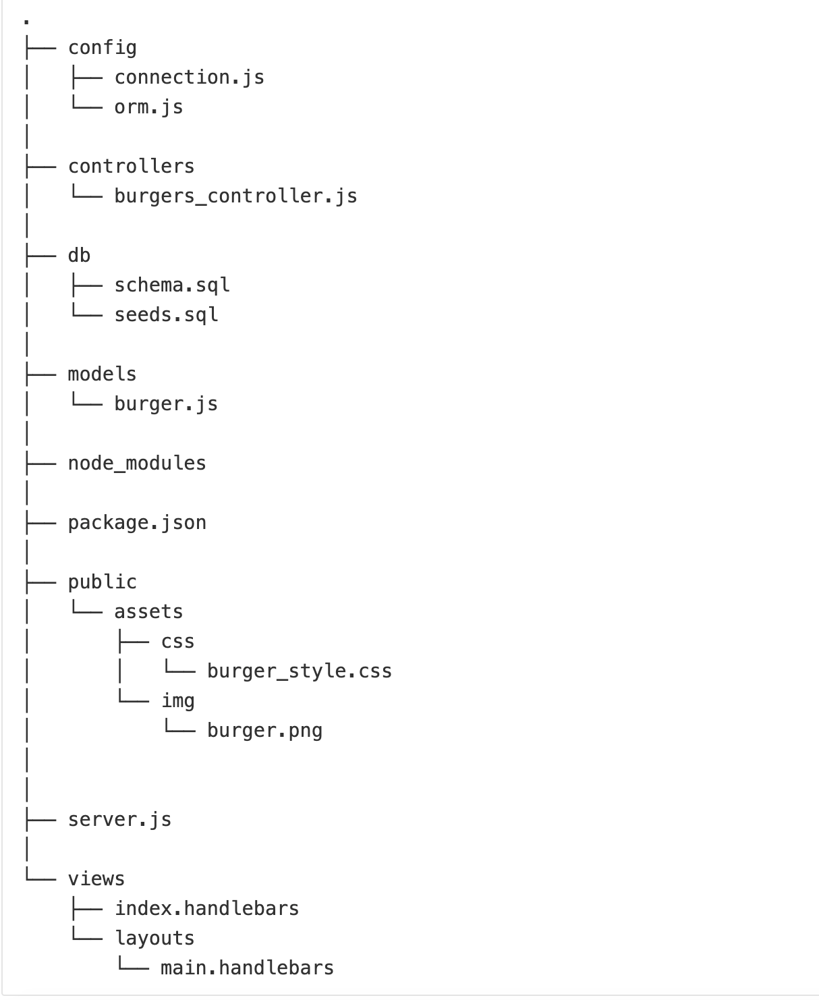

# Pc parts wishlist
Handlebars and mysql play a vital role in the scene of full stack web development. Handlebars interprets the information given, and generates an html structure from that information. Mysql stores that information and could send out that information by the user. Communication between these two key players generates a superteam that allows a programmer to futher proceed into effecient full stack web development. In this assignment we are tasked to create a full stack web devlopment application using Create, update, and delete methods with the new concepts of handlebars and mysql database communication. 
## Site picture 

## Installing
This project required a series of npm packages. Mysql, express, express-handlebars. These packages are the root for the development of this project and optimize the use of keywords. 
* These are the following instructions to activating this repo:
```
In the command line:
npm install
IF STARTING FROM SCRATCH (without packages.json) FOLLOWING THE INSTRUCTIONS BELOW:
npm init -y 
THEN: 
npm install [npm package name]
```
* The above section provides a proper install both preparatory and clean install.

## Getting Started
We are given a blank slate. No folders given to us but a set of instructions to follow a directory structure. 


## Author
* [Daniel Jauregui](https://kionling.github.io/responsive-portfolio1/index.html)

# Deployed links
* [Github Repository](https://github.com/Kionling/pc-part-wishlist)
* [Deployed Link](https://pcpartswish.herokuapp.com/)

## Acknowledgements 
* Cats deploy activity